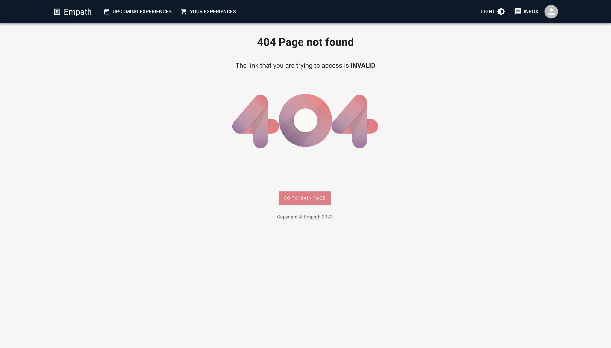

# Team TernaryOperator
The TernaryOperator Project has 3 services:
1. empath-ui [(Documentation)](https://github.com/DandelionProjects/TernaryOperator/tree/main/empath-ui)
2. empath-backend [(Documentation)](https://github.com/DandelionProjects/TernaryOperator/tree/main/empath-backend)
3. empath-admin-ui [(Documentation)](https://github.com/DandelionProjects/TernaryOperator/tree/main/empath-admin-ui)

## Emapth Product Video

[Click here](https://www.youtube.com/watch?v=xKR4vSYvK28&ab_channel=PrathmeshMhapsekar "Empath Product Video") to watch

## Empath Product Features

1. Mobile Responsive Application & Consistent Cross-Device Experience
2. Design Language powered by Google's Material UI
3. Seamless Instagram Integration
4. Instant Plug & Play Client
5. Highly Secure Services powered by Java's Spring Security
6. User Authentication using JWT tokens
7. Ledger functionality for Audit and Compliance
8. Swagger API tool for developer efficiency
9. Admin Portal for easy data management
10. Database version control using Liquibase
11. Daemon Scheduler Services for User Points Generation
12. Standardized Exception Handling
13. Simulators for Mock Scenarios
14. Configurable theming for the UI.
15. Dark/Light theme support and remembered theme preference for enhanced user experience.

## Empath Product Screenshot

### 1. Sign In Desktop Screen
|Title|Image|
|-----|-----|
|Dark||
|Light||

### 2. Sign In Mobile Screen

|Dark|Light|
|----|-----|
|||

### 3. Sign Up Desktop Screen
|Title|Image|
|-----|-----|
|Dark||
|Light||

### 4. Sign Up Mobile Screen
|Dark|Light|
|----|-----|
|||

### 5. Profile Desktop Screen
|Dark|Light|
|----|-----|
|||

### 6. Profile Mobile Screen

|Dark|Light|
|----|-----|
|||

### 7. Profile Instagram Auth Screen
|Steo 1|Step 2|
|----|-----|
|||

### 8. Your Experience Desktop Screen
|Dark|Light|
|----|-----|
|||

### 9. Your Experience Mobile Screen
|Dark|Light|
|----|-----|
|||

### 10. Upcoming Experience Desktop Screen
|Dark|Light|
|----|-----|
|||

### 11. Upcoming Experience Mobile Screen
|Dark|Light|
|----|-----|
|||

### 12. Experience Modal Desktop Screen
|Dark|Light|
|----|-----|
|||

### 13. Experience Modal Mobile Screen
|Dark|Light|
|----|-----|
|||

### 14. Messaging Desktop Screen
|Dark|Light|
|----|-----|
|||

### 15. Messaging Mobile Screen
|Dark|Light|
|----|-----|
|||

### 16. Checkout Desktop Screen
|Dark|Light|
|----|-----|
|||
|||
|||
|||

### 17. Checkout Mobile Screen
|Dark|Light|
|----|-----|
|||
|||
|||
|||

### 18. Page Not Found Desktop Screen
|Dark|Light|
|----|-----|
|||

### 19. Checkout Mobile Screen
|Dark|Light|
|----|-----|
|||

### 18. Admin Desktop Screen
|Title|Image|
|----|-----|
|Experience||
|Client||
|Order||
|User||
