# empath-backend

## About Empath
The project enables users to leverage their social media interaction and purchase history with different brands. The user gains points for the above activities and it can redeem experiences of their choice by using the collected points. The project is designed in a way to onboarded any clients with very less code change.

## About empath-backend
empath-backend is a microservice application based on Java Spring Boot Framework and is using MySQL DB as database. This is readme documentation of empath-backend. 

### Architecture
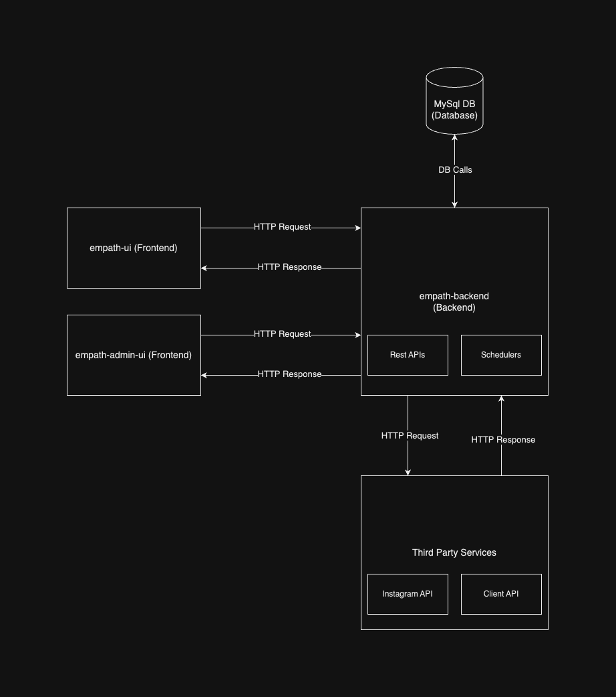

### Class Diagram

The service consist of three major components which are as follows:
## 1. Database
### a. Setup
The database used in this project is MySQL Relational Database. We can follow the below steps to setup the database.
1. Install MySQl on your Local Machine/Server.
2. Create a database named "empath"
3. Make necessary changes in the application-dev.yml file. Check the image below for reference
 
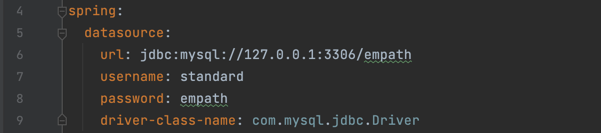
 
Note: In the image above, the parameters like url, username, password needs to be changed according to the database you have setup.

### b. ER Diagram
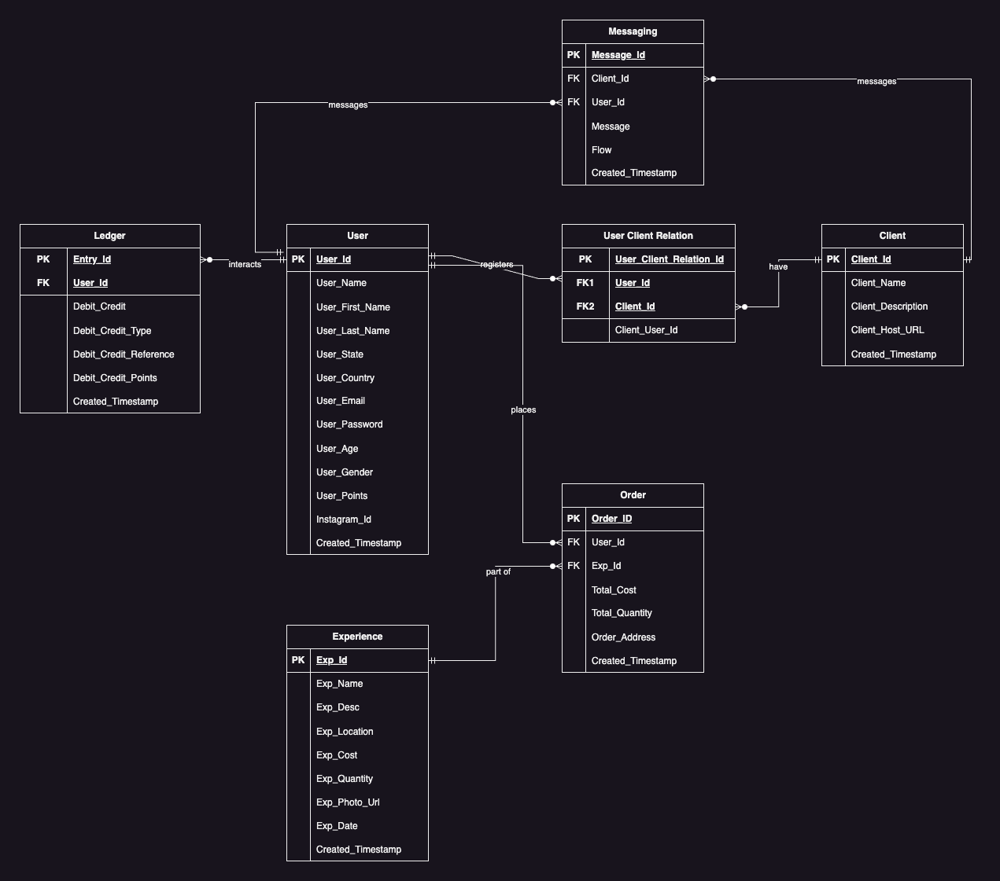

### c. Tables
#### i. User
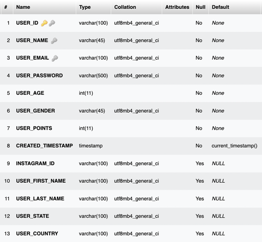
#### ii. Experience
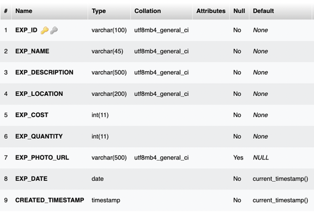
#### iii. Client
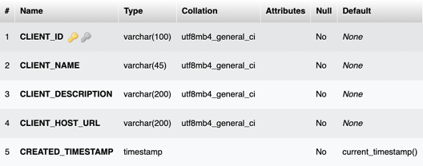
#### iv. Order
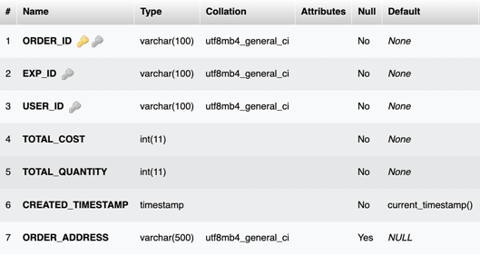
#### v. Messaging
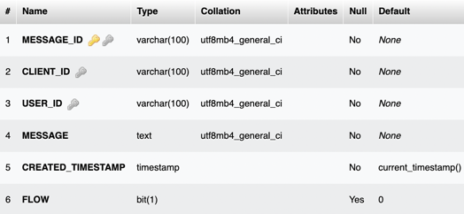
#### vi. User Client Relation
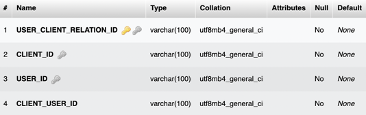
#### vii. Ledger
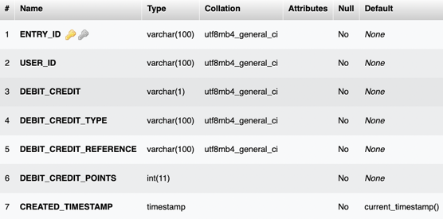

### d. Liquibase
Liquibase is an open-source database-independent library for tracking, managing and applying database schema changes.
Following is the Liquibase configuration:

The liquibase database files are in the db folder within the resource as shown below:

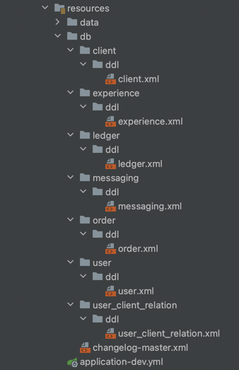

Following are the links to liquibase documentation:
- [Liquibase Documentation](https://docs.liquibase.com/)
- [Spring Boot Interaction with Liquibase](https://www.baeldung.com/liquibase-refactor-schema-of-java-app)

## 2. Application

### a. Models & DTOs (org.empath.model)
#### i. Client
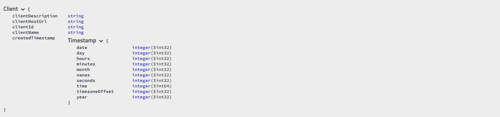

#### ii. Experience
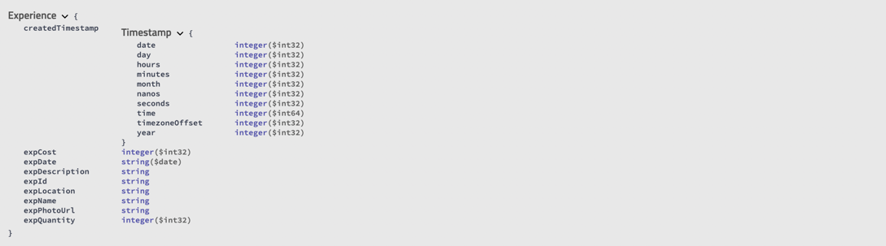

#### iii. Messaging
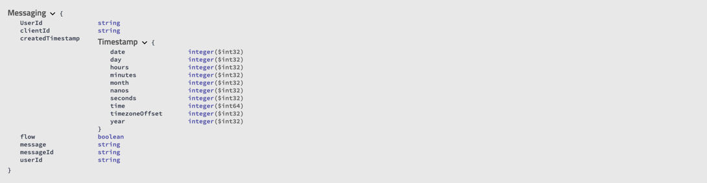

#### iv. Order
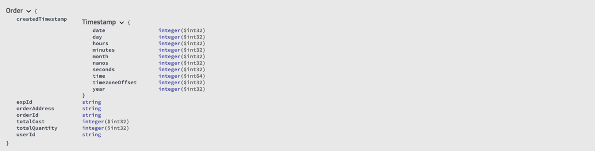

#### v. User

#### vi. User Client Relation

#### vii. Login Request

#### viii. Response

### b. Extended DTOs (org.empath.model.dto.internal)
| DTO Name        | Extended From      | DTO Description                                                               |
|-----------------|--------------------|-------------------------------------------------------------------------------|
| Experience Data | Experience         | Includes Order in addition to the exising Experience fields                   |
| Messaging Data  | Messaging          | Includes Client Name in addition to the existing Messaging Fields.            |
| Order Data      | Order              | Includes Experience Name in addition to the existing Order fields.            |
| UserClientData  | UserClientRelation | Includes Client Name in addition to the existing User Client Relation fields. |

### c. Repositories (org.empath.repository)
| Repository Name              | Model & Database Table Associated |
|------------------------------|-----------------------------------|
| ClientRepository             | Client                            |
| ExperienceRepository         | Experience                        |
| LedgerRepository             | Ledger                            |
| MessagingRepository          | Messaging                         |
| OrderRepository              | Order                             |
| UserClientRelationRepository | UserClientRelation                |
| UserRepository               | User                              |

### d. Rest APIs (org.empath.controller)
#### i. Client (Authorization Required)
| API Name                   | API URL                                | API Method | API Description                   | Response     | Request Body |
|----------------------------|----------------------------------------|------------|-----------------------------------|--------------|--------------|
| Add Client                 | /v1/client/addClient                   | POST       | Add a Client to the database      | null         | Client       |
| Delete Client By Client ID | /v1/client/deleteClientByClientId/{id} | DELETE     | Delete a Client from the database | null         | null         |
| Get All Clients            | /v1/client/getAllClients               | GET        | Get all Clients from the database | List(Client) | null         |
| Get Client By Client ID    | /v1/client/getClientByClientId/{id}    | GET        | Get a Client by Client ID         | Client       | null         |

#### ii. Experience (Authorization Required)
| API Name                                   | API URL                                     | API Method | API Description                                                                                 | Response             | Request Body |
|--------------------------------------------|---------------------------------------------|------------|-------------------------------------------------------------------------------------------------|----------------------|--------------|
| Add Experience                             | /v1/experience/addExperience                | POST       | Add a Experience to the database                                                                | null                 | Experience   |
| Delete Experience By Experience Id         | /v1/experience/deleteExperienceByExpId/{id} | DELETE     | Delete a Experience from the database                                                           | null                 | null         |
| Get All Experiences                        | /v1/experience/getAllExperiences            | GET        | Get all Experience from the database                                                            | List(Experience)     | null         |
| Get All Upcoming Experiences               | /v1/experience/getAllUpcomingExperiences    | GET        | Get all Experiences form the database that have more than 0 quantity and are after today's date | List(Experience)     | null         |
| Get a Experience By Experience Id          | /v1/experience/getExperienceByExpId/{id}    | GET        | Get a Experience from the database                                                              | Experience           | null         |
| Get all Experiences Purchased By a User ID | /v1/experience/getUserExperience/{id}       | GET        | Get all Experiences form the database purchased by a User with specified by the User ID         | List(ExperienceData) | null         |

#### iii. Messaging (Authorization Required)
| API Name                       | API URL                                     | API Method | API Description                                                                  | Response           | Request Body |
|--------------------------------|---------------------------------------------|------------|----------------------------------------------------------------------------------|--------------------|--------------|
| Add a Message                  | /v1/messaging/addMessage                    | POST       | Add a Message to the database                                                    | null               | Messaging    |
| Delete a Message By Message Id | /v1/messaging/deleteMessageByMessageId/{id} | DELETE     | Delete a Message from the database                                               | null               | null         |
| Get All Messages               | /v1/messaging/getAllMessages                | GET        | Get all Messages from the database                                               | List(Messaging)    | null         |
| Get All Messages By Client Id  | /v1/messaging/getMessagesByClientId/{id}    | GET        | Get all Messages form the database send to the Client specified by the Client ID | List(Messaging)    | null         |
| Get All Messages By User Id    | /v1/messaging/getMessagesByUserId/{id}      | GET        | Get all Messages form the database send to the User specified by the User ID     | List(MessaginData) | null         |

#### iv. Order (Authorization Required)
| API Name                   | API URL                             | API Method | API Description                                                                         | Response        | Request Body |
|----------------------------|-------------------------------------|------------|-----------------------------------------------------------------------------------------|-----------------|--------------|
| Add a Order                | /v1/order/addOrder                  | POST       | Add a Order to the database                                                             | String          | Order        |
| Delete a Order By Order Id | /v1/order/deleteOrderByOrderId/{id} | DELETE     | Delete a Order from the database                                                        | null            | null         |
| Get All Orders             | /v1/order/getAllOrders              | GET        | Get all Orders from the database                                                        | List(Order)     | null         |
| Get All Orders By Exp Id   | /v1/order/getOrderByExpId/{id}      | GET        | Get all Orders form the database associated with the Experience specified by the Exp ID | List(OrderData) | null         |
| Get All Orders By User Id  | /v1/order/getOrderByUserId/{id}     | GET        | Get all Orders form the database send to the User specified by the User ID              | List(OrderData) | null         |
| Get a Order By Order Id    | /v1/order/getOrderByOrderId/{id}    | GET        | Get a Order from the database                                                           | OrderData       | null         |

#### v. User (Authorization Required)
| API Name                        | API URL                                 | API Method | API Description                                                    | Response             | Request Body       |
|---------------------------------|-----------------------------------------|------------|--------------------------------------------------------------------|----------------------|--------------------|
| Add a User                      | /v1/user/addUser                        | POST       | Add a User to the database                                         | null                 | User               |
| Add a User Client Id            | /v1/user/addUserClientId                | POST       | Add a User's User Client Id associated to a Client in the database | null                 | UserClientRelation |
| Delete a User By User Id        | /v1/user/deleteUserByUserId/{id}        | DELETE     | Delete a User from the database                                    | null                 | null               |
| Get All Users                   | /v1/user/getAllUsers                    | GET        | Get all Users from the database                                    | List(UserProjection) | null               |
| Get a User By User Id           | /v1/user/getUserByUserId/{id}           | GET        | Get a User from the database                                       | UserProjection       | null               |
| Get User Client Data By User Id | /v1/user/getUserClientDataByUserId/{id} | GET        | Get a User's User Client Data from the database                    | List(UserClientData) | null               |
| Update Instagram ID By User Id  | /v1/user/updateInstagramIdByUserId/{id} | PUT        | Update a User's Instagram Id by User ID  in the database           | String (Param)       | null               |

#### vi. Login (Authorization Not Required)
| API Name | API URL            | API Method | API Description                            | Response       | Request Body  |
|----------|--------------------|------------|--------------------------------------------|----------------|---------------|
| Login    | /v1/security/login | POST       | Authenticate a User to provide a JWT token | Login Response | Login Request |

#### vii. Health (Authorization Not Required)
| API Name     | API URL                | API Method | API Description            | Response | Request Body |
|--------------|------------------------|------------|----------------------------|----------|--------------|
| Check Health | /v1/health/checkHealth | GET        | Check Application's Status | null     | null         |

Notes
1. All the above rest API's response are included in the body field of the Response DTO.
2. The default value fields in the database are not mandatory to be passed from the request body.
3. The primary key of all the tables should not be passed from the request body. It is auto generated using UUID.
4. User points should not be passed from the request body. It is auto generated as 0.

### e. Configurations (org.empath.configuration)
| Configuration Name | Configuration Description                                                                                                                                                                                                                                                                                                       |
|--------------------|---------------------------------------------------------------------------------------------------------------------------------------------------------------------------------------------------------------------------------------------------------------------------------------------------------------------------------|
| Security           | Configures which REST APIs requires authentication and which can be accessed directly. Also configures which origin is allowed as a http requester and which http methods are allowed. Finally it authenticates user with the database's User table and provide a expirable JWT token to access all the authenticated REST APIs |
| Swagger            | Configures Swagger tool for API developers                                                                                                                                                                                                                                                                                      |
| Date Time          | Configures default date time of the application as UTC                                                                                                                                                                                                                                                                          |

### f. Exception & Errors (org.empath.exception & org.empath.constants.ErrorCode)
Exception Class: EmpathException

| Error Code | Error Description      |
|------------|------------------------|
| E001       | Database Error         |
| E002       | Record not found       |
| E003       | Rest Error             |
| E004       | Parsing Error          |
| E005       | Duplicate Record Error |
| E006       | Insufficient Inventory |
| E007       | Insufficient Points    |

### g. Services (org.empath.service)
| Service Name                                 | Service Description                                                                                                                                                                                  |
|----------------------------------------------|------------------------------------------------------------------------------------------------------------------------------------------------------------------------------------------------------|
| ExperienceService                            | Processes request received from the Experience Controller and communicates with the database via repositories                                                                                        |
| MessagingService                             | Processes request received from the Messaging Controller and communicates with the database via repositories                                                                                         |
| ClientService                                | Processes request received from the Client Controller and communicates with the database via repositories                                                                                            |
| OrderService                                 | Processes request received from the Order Controller and communicates with the database via repositories                                                                                             |
| UserService                                  | Processes request received from the User Controller and communicates with the database via repositories                                                                                              |
| ClientIdService (Mock)                       | Authenticates user on the system with the specified clients system to get user's UserClientId                                                                                                        |
| InstagramService                             | Authenticates user on the system with Instagram to get user's Instagram Username                                                                                                                     |
| RestService                                  | Makes Get & Post HTTP Request to external services                                                                                                                                                   |
| PurchaseHistoryPointGenerationService (Mock) | Gets purchase history of all the user on the system for all the clients on the system done between last 1 hour and uses the data to increase user points for the returned users                      |
| SMInteractionPointGenerationService (Mock)   | Gets top commented users on all the post on the registered client's Instagram handle done between last 24th hour and last 23th hour and uses the data to increase user points for the returned users |

### h. Schedulers (org.empath.scheduler)
| Scheduler Name                          | Scheduler Description                                                | Cron        |
|-----------------------------------------|----------------------------------------------------------------------|-------------|
| PurchaseHistoryPointGenerationScheduler | Uses the PurchaseHistoryPointGenerationService and runs every 1 hour | 0 0 * * * * |
| SMInteractionPointGenerationScheduler   | Uses the SMInteractionPointGenerationService and runs every 1 hour   | 0 0 * * * * |

## 3. Third Party Services
### a. Client History API
This API returns the purchase history of all the registered users on the client's website. The API is currently mocked and thus the original API is also expected to be in the same structure as the mocked one. Following is the specification of the API: 

| Key              | Value                             |
|------------------|-----------------------------------|
| Method           | GET                               |
| Request          | null                              |
| Authorization    | Bearer Token                      |
| Response Model   | Response(List(ClientHistoryData)) |

Model Structure:

~~~json
{
"status":"string",
"body": [
        {
        "username": "string",
        "timestamp": "string"
        },
        {
        "username": "string",
        "timestamp": "string"
        }
  ]
}
~~~

Model Example:
~~~json
{
  "status": "Success",
  "body": [
    {
      "userName": "mandar1297",
      "timestamp": ""
    },
    {
      "userName": "mandar1297",
      "timestamp": ""
    },
    {
      "userName": "mandar1297",
      "timestamp": ""
    },
    {
      "userName": "prathmesh1297",
      "timestamp": ""
    },
    {
      "userName": "prathmesh1297",
      "timestamp": ""
    },
    {
      "userName": "prathmesh1297",
      "timestamp": ""
    }
  ]
}
~~~

### b. Instagram Access Token API (OAuth)
The API returns an expirable access token which is later used to call Instagram Basic User API. Following is the specification of the API:

| Key              | Value                                                                                               |
|------------------|-----------------------------------------------------------------------------------------------------|
| Method           | POST                                                                                                |
| Request          | client_id (Body) client_secret (Body) grant_type (Body) redirect_url (Body) code (Body) |
| Response Model   | InstagramAccessToken                                                                                |

Model Structure:

~~~json
{
  "user_id": "string",
  "access_token": "string"
}
~~~

Model Example:

~~~json
{
  "access_token": "IGQVJ...",
  "user_id": 17841405793187218
}
~~~

Reference:
[Instagram Basic Display API](https://developers.facebook.com/docs/instagram-basic-display-api/getting-started)

### c. Instagram Basic Display API (OAuth)
The API returns the username of the user who generated the code used to get the access token in Instagram Access Token API.

| Key            | Value                                  |
|----------------|----------------------------------------|
| Method         | GET                                    |
| Request        | fields (Param) access_token (Param) |
| Response Model | InstagramUserBasic                     |

Model Structure:

~~~json
{
  "id": "string",
  "username": "string"
}
~~~

Model Example:

~~~json
{
  "id": "17841405793187218",
  "username": "jayposiris"
}
~~~

Reference:
[Instagram Basic Display API](https://developers.facebook.com/docs/instagram-basic-display-api/getting-started)

### d. Instagram Media API
The API returns all IG Media on an IG User. Returns a maximum of 10K of the most recently created media.

| Key            | Value                |
|----------------|----------------------|
| Method         | GET                  |
| Request        | access_token (Param) |
| Response Model | InstagramMedias      |

Model Structure:

~~~json
{
  "data": [
    {
      "id": "string"
    },
    {
      "id": "string"
    },
    {
      "id": "string"
    },
    {
      "id": "string"
    },
    {
      "id": "string"
    },
    {
      "id": "string"
    }
  ],
  "paging": {
    "cursors": {
      "before": "string",
      "after": "string"
    }
  }
}
~~~

Model Example:

~~~json
{
  "data": [
    {
      "id": "17918195224117851"
    },
    {
      "id": "17895695668004550"
    },
    {
      "id": "17899305451014820"
    },
    {
      "id": "17896450804038745"
    },
    {
      "id": "17881042411086627"
    },
    {
      "id": "17869102915168123"
    }
  ],
  "paging": {
    "cursors": {
      "before": "",
      "after": ""
    }
  }
}
~~~

Reference:
[Instagram IG User Media API](https://developers.facebook.com/docs/instagram-api/reference/ig-user/media)

### e. Instagram Comments API
The API return IG Comments on an IG Media object. Returns only top-level comments. Replies to comments are not included unless you use field expansion to request the replies field.

| Key            | Value             |
|----------------|-------------------|
| Method         | GET               |
| Request        | media-id (Path)   |
| Response Model | InstagramComments |

Model Structure:

~~~json
{
  "data": [
    {
      "timestamp": "string",
      "text": "string",
      "id": "string"
    },
    {
      "timestamp": "string",
      "text": "string",
      "id": "string"
    }
  ]
}
~~~

Model Example:

~~~json
{
  "data": [
    {
      "timestamp": "2017-08-31T19:16:02+0000",
      "text": "This is awesome!",
      "id": "17870913679156914"
    },
    {
      "timestamp": "2017-08-31T18:10:30+0000",
      "text": "*Sniff*",
      "id": "17873440459141021"
    },
    {
      "timestamp": "2017-08-31T18:10:30+0000",
      "text": "Nice!!",
      "id": "17873440459141021"
    }
  ]
}
~~~

Reference:
[Instagram IG Media Comments API](https://developers.facebook.com/docs/instagram-api/reference/ig-media/comments)

### f. Instagram Comment API
The API returns details of the specified comment

| Key            | Value                                                                |
|----------------|----------------------------------------------------------------------|
| Method         | GET                                                                  |
| Request        | comment-id (Path)  access_token (Param)  fields="from" (Param) |
| Response Model | InstagramCommentedUser                                               |

Model Structure:

~~~json
{
  "from": "string"
}
~~~

Model Example:

~~~json
{
  "from": "mmandar100"
}
~~~

Reference:
[Instagram IG Comment APi](https://developers.facebook.com/docs/instagram-api/reference/ig-comment)

## Start Application

1. Install MySQL Server (We used XAMPP MySQL Server)
2. Install JDK & Maven
3. Install VSCode
4. Install following extensions in VSCode: Extension Pack for Java, Spring Boot Extension Pack. (https://code.visualstudio.com/docs/java/java-spring-boot)
5. Start the SQL Server (Change config if needed in application-dev.yml)
6. Open the project in VSCode
7. Run/Debug the project
8. You can import all the DML Data for testing purposes. (data/empath-dml.sql)
